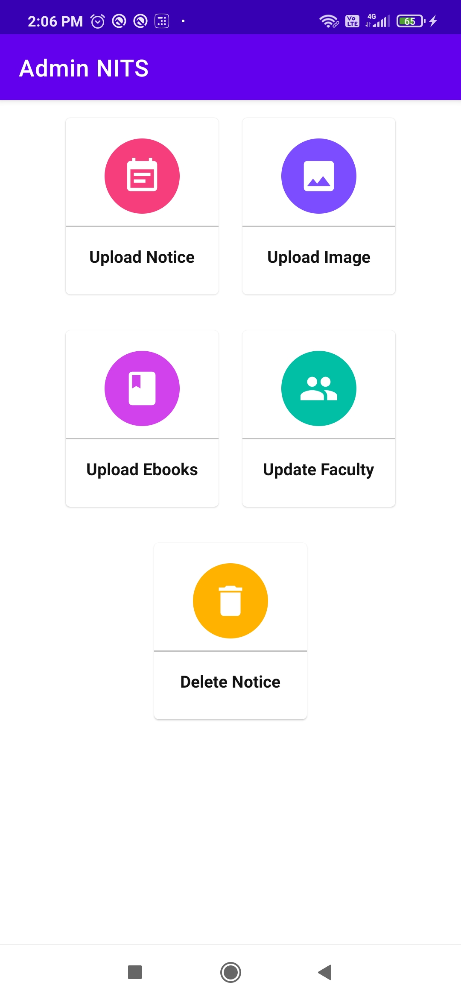
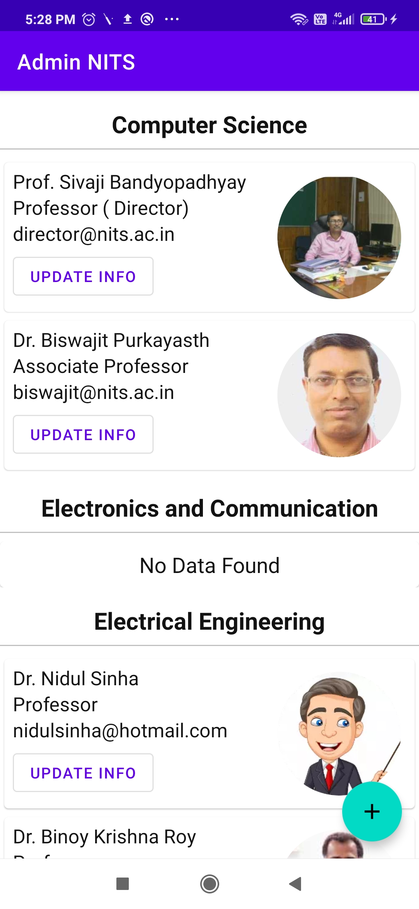
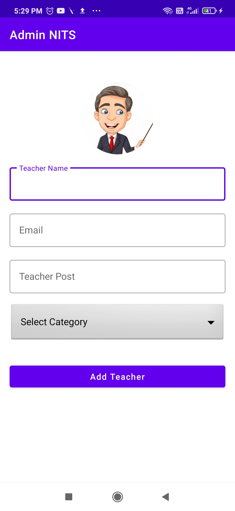
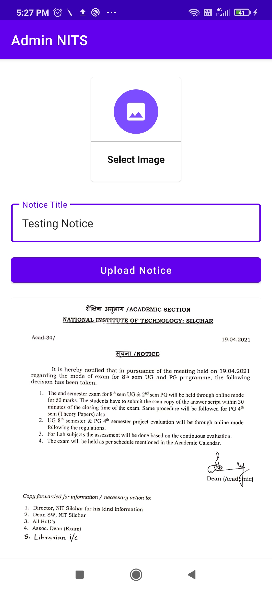
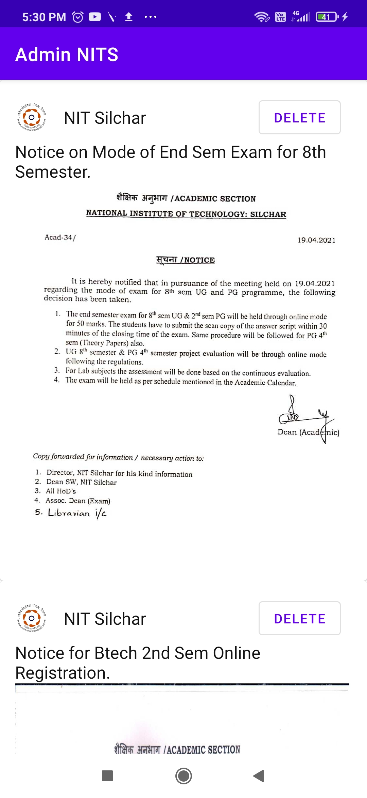

# Admin-NITS-App
It is the Admin app for My NITS App. 

### Project Overview

- My NITS app helps a user to know about the college NIT Silchar. Users gets information of all the departments and their respective faculty members.
- User can view various gallery images of various events of the college. Users can also view (in pdf form) and download available Ebooks from the app.  
- Users gets updates on latest notices from the university.
- Now all the uploads, updates and deletion in the Firebase backend is managed by an Admin using the Admin-NITS-App. 

### Features
- Admins can register/sign in.
- Admin can upload latest notices and also update existing ones using the Admin app.
- Admin can upload new event images, add new Ebooks to the Firebase Realtime Database using the app.
- Admin can add new faculty, update or delete existing ones.

### Tech Stack Used
Java, xml, Android Studio, Git, Firebase Realtime Database, Firebase Storage. 

### Screenshots

<kbd>
 
</kbd>
<h4>&ensp; Home Page </h4>

 

  <kbd>
  
  </kbd>
  &ensp; &ensp;
   <kbd>
   
   </kbd>

<h4>&ensp; Update Faculty Layout &ensp;&ensp;&&ensp;&ensp; Add Faculty Layout </h4>

 
 

  <kbd>
    
  </kbd>
  &ensp; &ensp;
   <kbd>
    
   </kbd>

<h4>&ensp; Add Notice Layout &ensp;&ensp;&&ensp;&ensp; Delete Notice Layout </h4>

